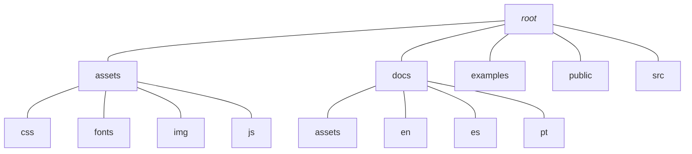

## Directory structure
...

<!-- https://mermaid.ink/img/pako:eNpVUMtuwyAQ_BXEoadYVWKfrCiHqvmC9rbkQNl1QmUeAqy2ivLvBYwr9bDD7O7MgLhz5ZD4yKfZfambDIm9vwjLGJMgY6QUL2u3BxU3foDJ2b9ND9pcGx_gcxuzruuyjT1lfYG-wFB3FRDQqSbG_b_L8ABkG-2BtukAPjVaw7GEYwnHEo4Dq9lVQUDf0vh5M3vwy8es1dpFiKHRCsG5BEd9KufxWZ8u6-NLaC7K5XNFYfmOGwpGasxfdi9ewdONDAk-Zoo0yWVOggv7yNLFo0x0Rp1c4OMk50g7Lpfk3n6s4mMKC22iVy2vQZqmevwCp2p8Kw -->

### assets
...

### docs
...

### examples  
...

### public
...

### src
...
