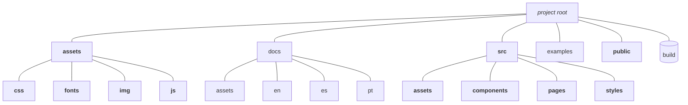

## Directory structure
In this project de standard ReactJS folders was generated by *create-react-app* (as bold ones in the illustration), and some other was added after.
...

<!-- https://mermaid.ink/img/pako:eNpVUMtuwyAQ_BXEoadYVWKfrCiHqvmC9rbkQNl1QmUeAqy2ivLvBYwr9bDD7O7MgLhz5ZD4yKfZfambDIm9vwjLGJMgY6QUL2u3BxU3foDJ2b9ND9pcGx_gcxuzruuyjT1lfYG-wFB3FRDQqSbG_b_L8ABkG-2BtukAPjVaw7GEYwnHEo4Dq9lVQUDf0vh5M3vwy8es1dpFiKHRCsG5BEd9KufxWZ8u6-NLaC7K5XNFYfmOGwpGasxfdi9ewdONDAk-Zoo0yWVOggv7yNLFo0x0Rp1c4OMk50g7Lpfk3n6s4mMKC22iVy2vQZqmevwCp2p8Kw -->

### assets

Mostly consist of static website images (`.png`,`.svg`...), fonts and any other static files that might be needed.

### (build)

The [ReactJs install guide](react.md) show how to *build* the website, that resultas in a set of static HTML files at the *build* folder. So, it is redundant, can statey out of git repository using `.gitignore` directive to remove it.

### docs
All project documentation: website requirements, general guidelines and specifications for page layout and  software development.

The `./docs/assets` is analog of the website assets, but for documentation content.

### examples
A *docs* folder complement. Some initial examples used as reference in requirements. Can be removed.

### public
The files that will be copied as-is in the build website.
For the project to build, some files must exist with exact filenames at *public* and *src* folders:

* `public/index.html` is the page template; only files inside *public* can be used from `index.html`;
* `src/index.js` is the JavaScript entry point.

### src

Is where we keep the project's source code. For faster rebuilds, only files inside *src* are processed by *webpack*.
